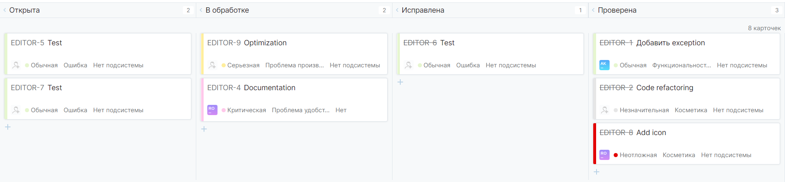
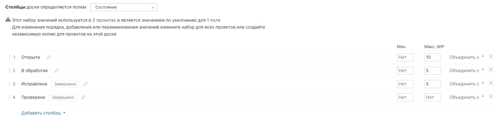
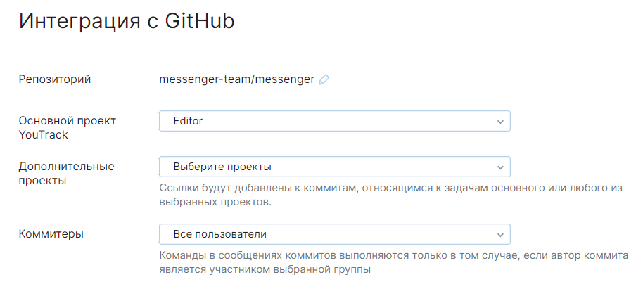
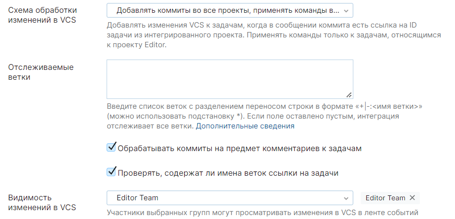
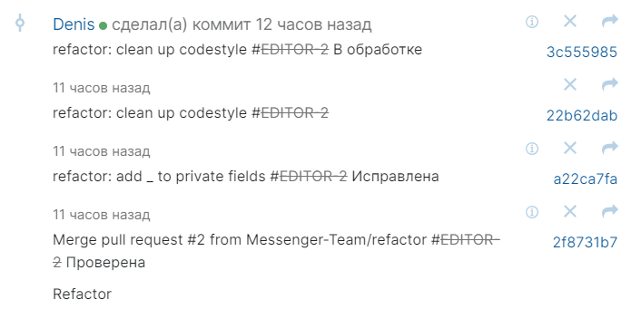
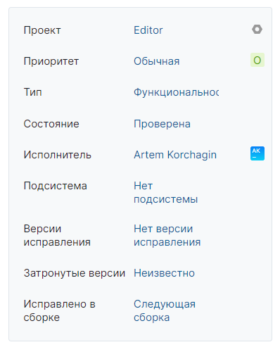
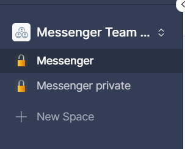
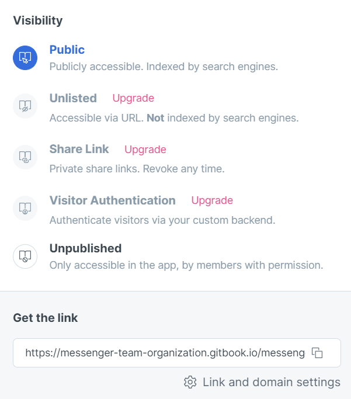
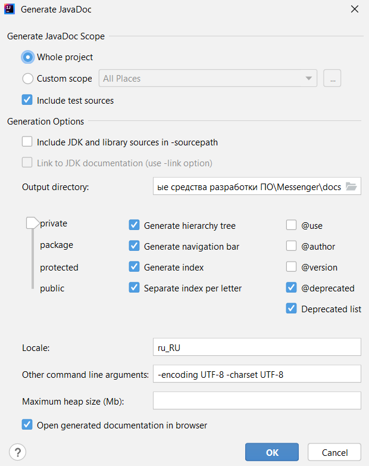

# Отчёт

## Задание 1

Выберем проект ["Messenger"](https://github.com/Messenger-Team/Messenger)

## Задание 2

Столбцы доски

WIP

## Задание 3

Настройка интеграции с GitHub

Пример отображения активности в ветке

## Задание 4

Пример настройки задачи

## Задание 6

Для документации используем GitBook

[Ссылка на публичную документацию](https://messenger-team-organization.gitbook.io/messenger/)

## Задание 7

Для того, чтобы сделать часть документации публичной, а часть приватной, создадим 2 space

Чтобы выложить в открытый доступ публичную часть выберем в настройках публикации опцию Public

## Задание 8

Для генерации Javadoc выберем в Intellij IDEA Tools->Generate Javadoc... и зададим следующие параметры

